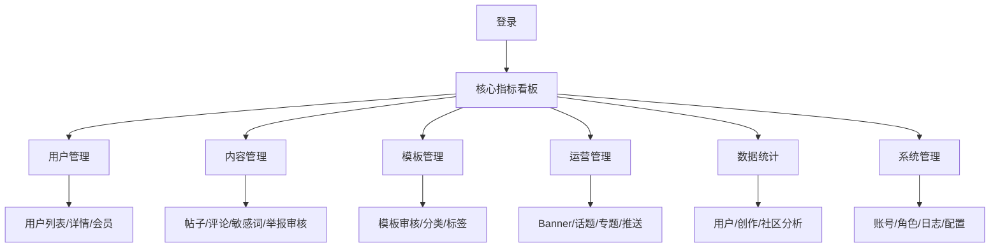

# 拼豆后台管理系统 · 产品需求文档（PRD）

> **项目**: 拼豆 - AI 照片转拼豆工具（后台管理系统）
> **版本**: V0.1
> **关联文档**: 后台管理系统需求规格说明书_v0.1.md、UI-back 原型

## 1. 产品概述

拼豆后台管理系统是支撑移动端业务运营的管理平台，提供用户管理、内容审核、模板管理、运营配置、数据分析、系统配置等核心功能，覆盖 7 大业务模块、25+ 关键页面。面向超级管理员、运营、审核、客服 4 类角色。

## 2. 核心功能

### 2.1 角色与权限
| 角色 | 用户管理 | 内容审核 | 模板管理 | 运营配置 | 数据统计 | 系统配置 |
|------|----------|----------|----------|----------|----------|----------|
| 超级管理员 | ✓ | ✓ | ✓ | ✓ | ✓ | ✓ |
| 运营 | - | - | ✓ | ✓ | ✓ | - |
| 审核 | - | ✓ | - | - | - | - |
| 客服 | - | 查看 | - | - | - | - |

### 2.2 功能模块

1. **登录与权限**：账号密码登录、验证码、角色权限、账号管理、操作日志
2. **用户管理**：用户列表、用户详情、会员管理、禁用/解禁
3. **内容管理**：帖子审核、评论审核、敏感词管理、举报管理
4. **模板管理**：模板列表、模板审核、分类管理、标签管理
5. **运营管理**：Banner 管理、话题管理、专题管理、推送管理
6. **数据统计**：核心指标、用户分析、创作分析、社区分析
7. **系统配置**：通用配置、AI 配置、色板配置、账号/角色/日志

### 2.3 页面清单
| # | 页面 | 路由 | 模块 |
|---|------|------|------|
| 1 | 登录页 | /auth/login | 登录与权限 |
| 2 | 核心指标看板 | /dashboard | 运营总览 |
| 3 | 用户列表 | /user/list | 用户管理 |
| 4 | 用户详情 | /user/:id | 用户管理 |
| 5 | 会员列表 | /member/list | 用户管理 |
| 6 | 帖子审核 | /post/review/list | 内容管理 |
| 7 | 帖子审核详情 | /post/review/:id | 内容管理 |
| 8 | 评论审核 | /comment/review/list | 内容管理 |
| 9 | 敏感词管理 | /sensitive/word/list | 内容管理 |
| 10 | 举报管理 | /report/list | 内容管理 |
| 11 | 模板列表 | /template/list | 模板管理 |
| 12 | 模板审核详情 | /template/review/:id | 模板管理 |
| 13 | 分类管理 | /template/category/list | 模板管理 |
| 14 | 标签管理 | /template/tag/list | 模板管理 |
| 15 | Banner 管理 | /banner/list | 运营管理 |
| 16 | 话题管理 | /topic/list | 运营管理 |
| 17 | 专题管理 | /topic/special/list | 运营管理 |
| 18 | 推送管理 | /push/list | 运营管理 |
| 19 | 用户分析 | /stats/user | 数据统计 |
| 20 | 创作分析 | /stats/creation | 数据统计 |
| 21 | 社区分析 | /stats/community | 数据统计 |
| 22 | 账号管理 | /system/admin/list | 系统管理 |
| 23 | 角色权限 | /system/role/list | 系统管理 |
| 24 | 操作日志 | /system/log/list | 系统管理 |
| 25 | 系统配置 | /config/general | 系统管理 |

## 3. 核心流程

## 4. 用户界面设计

### 4.1 设计风格

- **主色**: `#FF7A5A`（温暖橙）+ 强调色 `#F5C45E`（琥珀黄）
- **辅色**: `#4FBB8A`（薄荷绿成功）/ `#E07777`（玫瑰红危险）/ `#6FA8D4`（天空蓝信息）
- **中性色**: `#F7F4EE` 背景 / `#FFFFFF` 表面 / `#1F1A16` 文字
- **字体**: Inter + Noto Sans SC + JetBrains Mono（数据/ID）
- **圆角**: 6px 输入 / 7px 卡片 / 10px 容器 / 14px 浏览器外壳
- **风格**: 温暖色系 · 8dp 网格 · 单色强调 · 紧凑信息密度

### 4.2 布局模式

- **后台主布局**：左侧 200px 导航 + 右侧主区（头部 + 标签 + 工具栏 + 表格 + 分页）
- **详情布局**：左侧主信息面板 + 右侧 320px 操作面板
- **登录页**：左侧表单 + 右侧品牌渐变色块
- **浏览器外壳**：用于原型预览，正式版本不带浏览器外壳

### 4.3 响应式

桌面优先（1280px+），兼容 1024px+ 平板；后台管理不做移动端适配。
