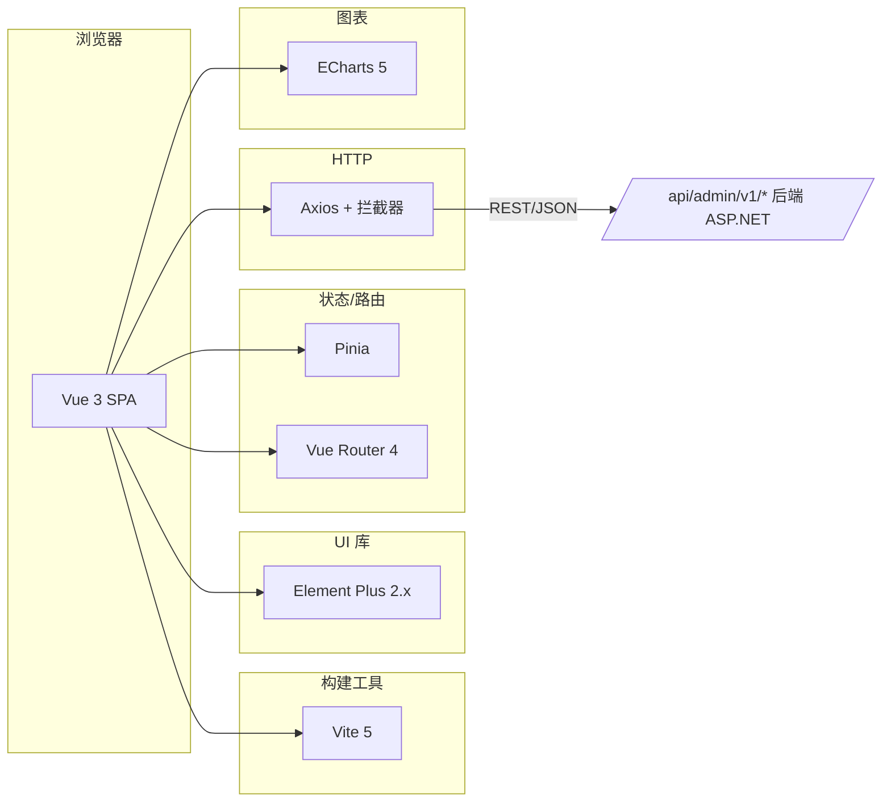

# 拼豆后台管理系统 · 技术架构文档

> **项目**: 拼豆 - AI 照片转拼豆工具（后台管理系统）
> **版本**: V0.1
> **关联文档**: 总体架构设计文档_v0.2.md、详细设计文档01-07

## 1. 架构设计



## 2. 技术选型

- **前端框架**: Vue 3.4+（Composition API + `<script setup>`）
- **构建工具**: Vite 5
- **语言**: TypeScript 5
- **UI 组件库**: Element Plus 2.x（按需自动导入）
- **状态管理**: Pinia 2
- **路由**: Vue Router 4
- **HTTP**: Axios 1.x（统一拦截器 + Token 注入 + 错误处理）
- **图表**: ECharts 5（按需引入）+ vue-echarts
- **工具库**: dayjs（日期）、@vueuse/core（组合式工具）
- **图标**: Element Plus Icons
- **代码规范**: ESLint + Prettier

## 3. 路由定义

| 路由 | 页面 | 角色 |
|------|------|------|
| /auth/login | 登录页 | 公开 |
| /dashboard | 核心指标看板 | 全部已登录 |
| /user/list | 用户列表 | 超级管理员/客服 |
| /user/:id | 用户详情 | 超级管理员/客服 |
| /member/list | 会员列表 | 超级管理员/运营 |
| /post/review/list | 帖子审核 | 超级管理员/审核 |
| /post/review/:id | 帖子审核详情 | 超级管理员/审核 |
| /comment/review/list | 评论审核 | 超级管理员/审核 |
| /sensitive/word/list | 敏感词管理 | 超级管理员/审核 |
| /report/list | 举报管理 | 超级管理员/审核 |
| /template/list | 模板列表 | 超级管理员/运营 |
| /template/review/:id | 模板审核详情 | 超级管理员/运营 |
| /template/category/list | 分类管理 | 超级管理员/运营 |
| /template/tag/list | 标签管理 | 超级管理员/运营 |
| /banner/list | Banner 管理 | 超级管理员/运营 |
| /topic/list | 话题管理 | 超级管理员/运营 |
| /topic/special/list | 专题管理 | 超级管理员/运营 |
| /push/list | 推送管理 | 超级管理员/运营 |
| /stats/user | 用户分析 | 超级管理员/运营 |
| /stats/creation | 创作分析 | 超级管理员/运营 |
| /stats/community | 社区分析 | 超级管理员/运营 |
| /system/admin/list | 账号管理 | 超级管理员 |
| /system/role/list | 角色权限 | 超级管理员 |
| /system/log/list | 操作日志 | 超级管理员 |
| /config/general | 系统配置 | 超级管理员 |

## 4. API 对接（基于详细设计文档01-07）

| 模块 | Base | 文档 |
|------|------|------|
| 登录与权限 | /api/admin/v1/auth | 01-登录与权限模块详细设计 |
| 用户管理 | /api/admin/v1/user | 02-用户管理模块详细设计 |
| 内容管理 | /api/admin/v1/post /comment /sensitive /report | 03-内容管理模块详细设计 |
| 模板管理 | /api/admin/v1/template /category /tag | 04-模板管理模块详细设计 |
| 运营管理 | /api/admin/v1/banner /topic /special /push | 05-运营管理模块详细设计 |
| 数据统计 | /api/admin/v1/stats | 06-数据统计模块详细设计 |
| 系统配置 | /api/admin/v1/config /admin /role /log | 07-系统配置模块详细设计 |

请求规范：
- Method: GET/POST/PUT/DELETE
- Headers: `Content-Type: application/json`、`Authorization: Bearer {admin_token}`
- 响应: `{ code, message, data }`，code=0 成功

## 5. 目录结构

```
backview/
├── index.html
├── package.json
├── tsconfig.json
├── vite.config.ts
├── src/
│   ├── main.ts
│   ├── App.vue
│   ├── api/              # 所有模块 API 封装
│   ├── assets/           # 静态资源
│   ├── components/       # 通用业务组件
│   ├── composables/      # 组合式函数
│   ├── layouts/          # 布局
│   ├── router/           # 路由
│   ├── stores/           # Pinia stores
│   ├── styles/           # 全局样式（与 UI-back 一致的设计系统）
│   ├── types/            # TS 类型定义
│   ├── utils/            # 工具（request、auth、format）
│   └── views/            # 页面
│       ├── auth/
│       ├── dashboard/
│       ├── user/
│       ├── post/
│       ├── template/
│       ├── operation/
│       ├── stats/
│       └── system/
```

## 6. 数据模型（关键 TS 类型）

```typescript
interface AdminUser {
  id: string
  username: string
  nickname: string
  role_id: string
  role_name: string
  status: 'active' | 'disabled'
  last_login_time: string
  avatar?: string
}

interface PageResult<T> {
  list: T[]
  total: number
  page: number
  page_size: number
}
```

## 7. 设计系统（与 UI-back 完全一致）

- **CSS 变量**: 在 `styles/tokens.css` 定义 `bg / ink / primary / mint / rose / sky / violet / warn / line / radius / shadow`
- **复用样式**: 卡片、表格、表单、按钮、标签、徽标、状态点、头像、空状态、分页、面包屑
- **登录页渐变**: `linear-gradient(160deg,#FFE6D4 0%,#FFD2B8 60%,#F5C45E 100%)`
- **品牌主色**: `#FF7A5A`（拼豆橙）
